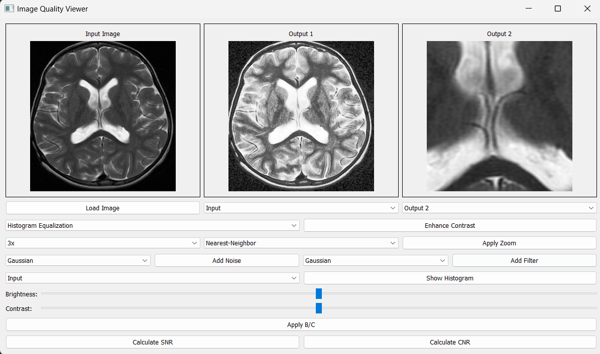
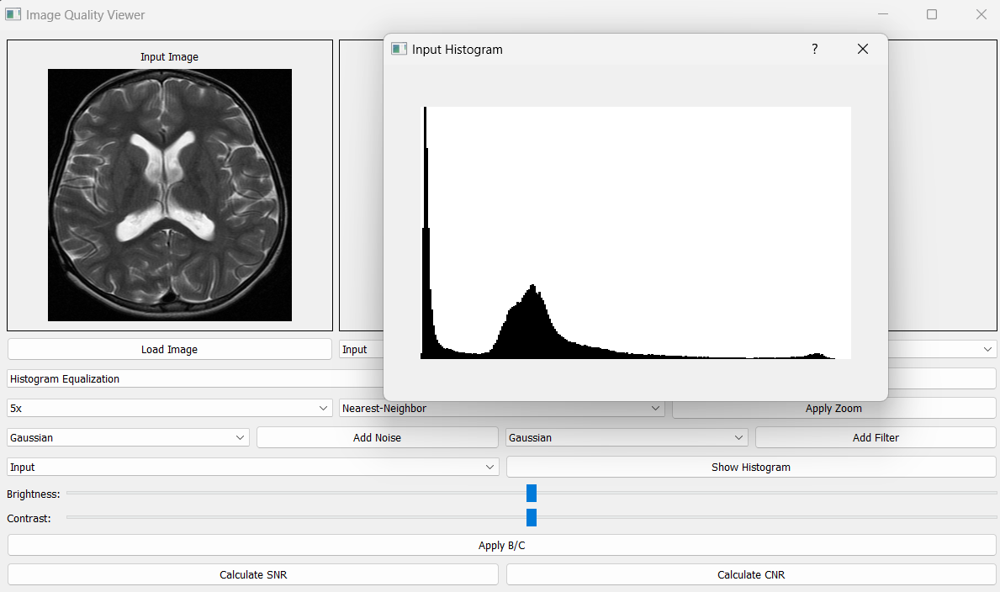

# Image Quality Viewer

## Overview

The Image Quality Viewer is a powerful desktop application designed for medical and scientific image analysis. It provides a comprehensive suite of tools for image enhancement, noise analysis, and quality assessment, making it ideal for researchers, medical professionals, and image processing specialists.

This application enables users to load medical or scientific images and apply various processing techniques in real-time. With its intuitive interface featuring three display panels (Input, Output 1, Output 2), users can easily compare different processing results side by side. The tool supports advanced operations such as contrast enhancement, noise simulation, filtering, and quantitative measurements including SNR (Signal-to-Noise Ratio) and CNR (Contrast-to-Noise Ratio) calculations, essential for medical image quality assessment.


## Features

- **Image Loading and Display**
  - Support for common image formats (PNG, JPG, BMP)
  - Multiple view panels (Input, Output 1, Output 2)
  - Synchronized display of original and processed images

- **Image Enhancement**
  - Histogram Equalization
  - CLAHE (Contrast Limited Adaptive Histogram Equalization)
  - Gamma Correction
  - Brightness and Contrast adjustment

- **Zoom and Interpolation**
  - Multiple zoom levels (0.25x to 5x)
  - Various interpolation methods:
    - Nearest-Neighbor
    - Linear
    - Bilinear
    - Cubic

- **Noise Generation**
  - Gaussian noise
  - Salt and Pepper noise
  - Speckle noise

- **Filtering Options**
  - Gaussian filter
  - Bilateral filter
  - Non-Local Means denoising
  - Low-Pass filter
  - High-Pass filter

- **Analysis Tools**
  - Real-time histogram visualization
  - SNR (Signal-to-Noise Ratio) calculation
  - CNR (Contrast-to-Noise Ratio) calculation

## ScreenShots
   
 

## Installation

### Prerequisites
```bash
python >= 3.6
```

### Required Libraries
```bash
pip install PyQt5
pip install opencv-python
pip install numpy
pip install matplotlib
```

## Usage

1. Run the application:
```bash
python MultiViewBoard.py
```

2. Basic Operations:
   - Click "Load Image" to open an image file
   - Select the source image (Input/Output1/Output2) from the dropdown
   - Choose the target output window (Output1/Output2)
   - Apply desired operations using the control panel

3. Enhancement Operations:
   - Select enhancement type (Histogram Equalization/CLAHE/Gamma Correction)
   - Click "Enhance Contrast" to apply
   - Adjust brightness/contrast using sliders
   - Click "Apply B/C" to apply brightness/contrast changes

4. Noise and Filtering:
   - Select noise type (Gaussian/Salt and Pepper/Speckle)
   - Click "Add Noise" to apply
   - Select filter type (Gaussian/Bilateral/Non-Local Means/Low-Pass/High-Pass)
   - Click "Add Filter" to apply

5. Analysis:
   - Click "Show Histogram" to view intensity distribution
   - Use "Calculate SNR" to measure Signal-to-Noise Ratio
   - Use "Calculate CNR" to measure Contrast-to-Noise Ratio

## Quality Metrics

### SNR Calculation
- Select ROIs for signal and noise regions
- The application calculates SNR using: SNR = mean(signal) / std(noise)

### CNR Calculation
- Select ROIs for two regions and noise
- CNR is calculated as: CNR = |mean(region1) - mean(region2)| / std(noise)

## Interface Components

- Main display area with three image panels
- Control panel with operation selection dropdowns
- Brightness and contrast adjustment sliders
- Zoom control with interpolation method selection
- Noise and filter type selection
- Analysis tools for quality metrics
  
## Acknowledgments
Special thanks to Dr.Tamer Basha, whose guidance and expertise have been invaluable in the development of this project. We deeply appreciate your support and insightful feedback, which have significantly enhanced the application's design and functionality.

Additionally, thanks to the open-source community for providing tools and libraries that made this project possible.
