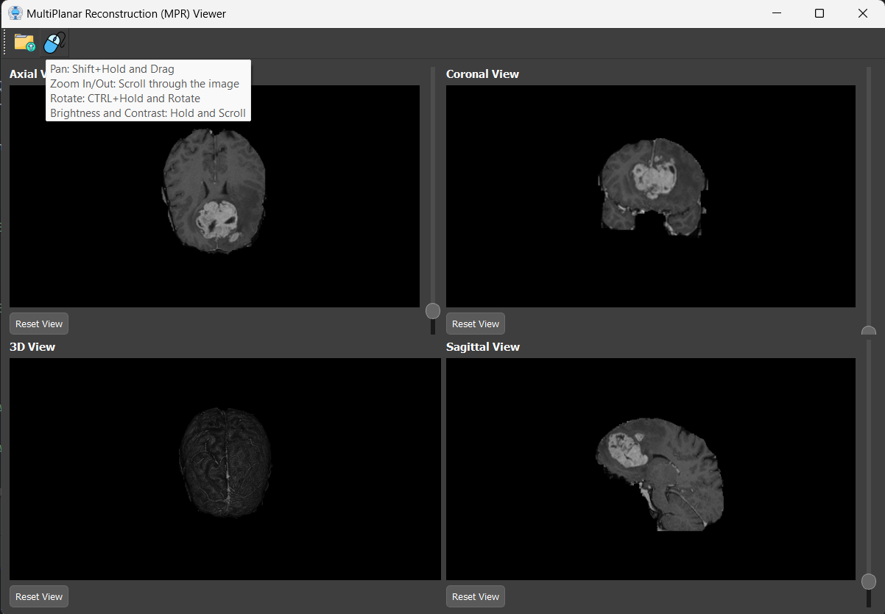

# Multi-Planar Reconstruction (MPR) Viewer


## Overview
This Multi-Planar Reconstruction (MPR) Viewer is a desktop application designed for visualizing and interacting with medical images in multiple planes of DICOM and MHD format. It provides intuitive navigation and manipulation features to aid in exploring 3D volumes and their 2D projections.

## Features

### Multi-Planar Viewports
- **3 Simultaneous Viewports:** Displays axial, coronal, and sagittal slices of a 3D volume.
- **3D Model View:** Includes an additional panel to render and interact with the 3D model of the volume.
- **Real-time Updates:** Any slice in one viewport is indicated on the other two viewports and the 3D model.

### Navigation Features
- **Scroll Through Slices:** Navigate through slices in each planar view using mouse scroll or keyboard.
- **Slice Indication:** Indicates the current slice position in other planar viewers and the 3D model to maintain orientation.

### Image Manipulation Features
- **Zoom:** Zoom in and out using the mouse scroll or dedicated zoom controls.
- **Pan:** Shift + Hold and Drag to pan across the image for a closer look at specific areas.
- **Rotate:** CTRL + Hold and Rotate to rotate the image in 3D for better visualization.
- **Brightness/Contrast Control:** Hold and Scroll to adjust brightness and contrast interactively.

### Point Localization
- **3D Volume Point Localization:** Select a point in the 3D volume or any 2D viewer and instantly visualize its corresponding location in all views.

### Layout and Controls
- **Four Panels:** The application window consists of four panels:
  1. Axial view
  2. Coronal view
  3. Sagittal view
  4. 3D Model view
- **Slider:** A slider to navigate through slices in the selected view.
- **Reset Button:** Resets the view and slider to the initial state for quick re-orientation.

## Usage

1. **Upload Images:** Use the toolbar to load your medical image files (e.g., DICOM).
2. **Navigate Slices:** Scroll through slices in each viewport and observe their relative positions in the other views and the 3D model.
3. **Manipulate Images:**
   - **Pan:** Shift + Hold and Drag.
   - **Zoom In/Out:** Scroll through the image.
   - **Rotate:** CTRL + Hold and Rotate.
   - **Brightness/Contrast:** Hold and Scroll.
4. **Point Localization:** Click on a point in the 3D volume or any 2D viewer to see its position with respect to all views.
5. **Reset Views:** Use the reset button to return all views and sliders to their default state.

### Requirements
- Python 3.7+
- PyQt5
- VTK
- pydicom

### Folder Structure
```
📂 MultiPlaner-Reconstruction
├── 📂 src
│   ├── MPR.py       # Entry point of the application
├── 📂 data_example   # a sample data for testing
├── 📂 Icons          # Icons, styles, and other assets
└── README.md         # This file
```

## Acknowledgments
Special thanks to Dr.Tamer Basha, whose guidance and expertise have been invaluable in the development of this project. We deeply appreciate your support and insightful feedback, which have significantly enhanced the application's design and functionality.

Additionally, thanks to the open-source community for providing tools and libraries that made this project possible.

